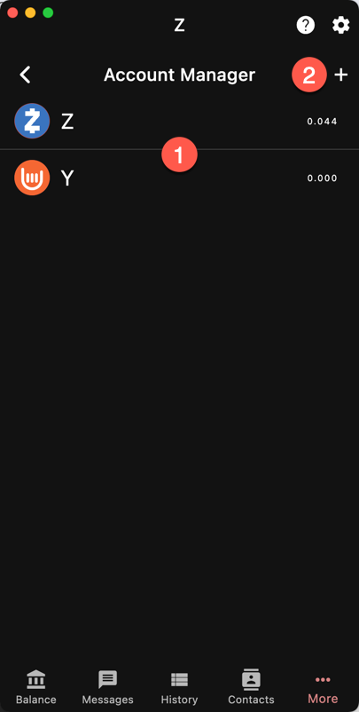

`More/Accounts`

The Account Manager is where you add/edit/delete accounts.

## Switch Account

To change the current account, tap on its name.

## New

[See new account]({})

## Edit/Delete

Long press on an account name to enter edit mode.
Then you will have the option to rename or delete it.

{}
The current account cannot be deleted unless it is
the only account remaining. You need to switch to
another account.
{}

At the moment, there is no way to reorder accounts.