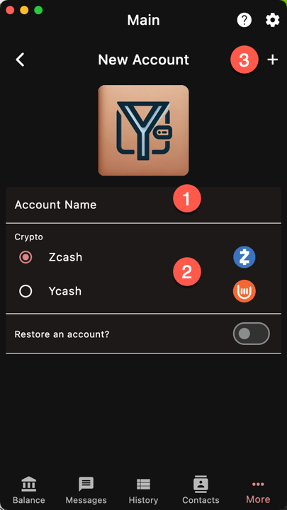
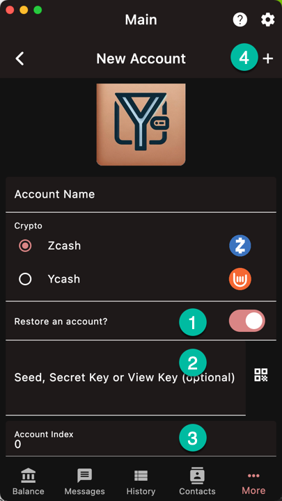

## New

1. Enter the account name (required)
1. Choose the crypto
1. Press to create a new account

The process should only take a few seconds.

## Restore

1. Turn on the restore switch
1. Enter the wallet key
1. Choose the account index. 
The account index is part of the derivation path. This is *NOT* the wallet
birth height. If you are unsure, leave it at 0
1. Press to restore the account

The account is created but the blockchain data is not 
[rescanned]({}).

Therefore you will not see your balance yet.

{}
Usually after an import, the wallet has to 
[rescan]({}) older blocks.
If you are restoring multiple accounts, it is recommended
to rescan *after* you imported them all
because the rescan will process all the accounts simulatenously.

{}

## Keys accepted

- Seed phrase: 12, 15, 18, 24 words + 1 optional password
- Sapling secret key
- Sapling viewing key
- Unified viewing key

Transparent private keys are *NOT* accepted. Use the sweep function
to transfer funds from a transparent address.
