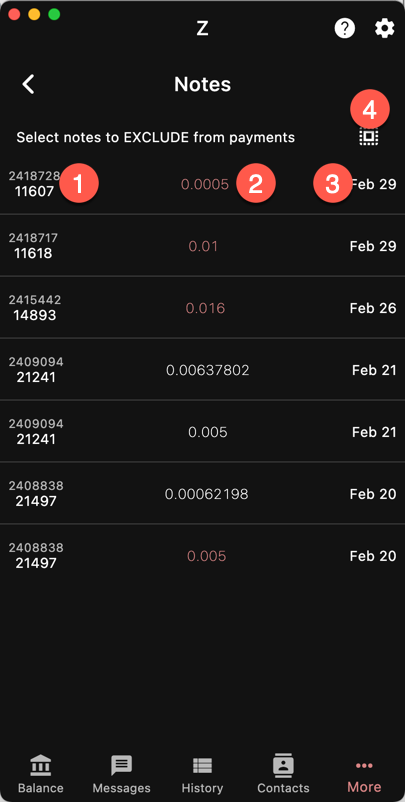

`More/Notes`

This page shows the unused shielded notes received.
Transparent notes (UTXO) are not managed and will not show up.
For more info, see
[Synchronization]({}).

For the most part, notes are automatically selected
when making payments. However, you can exclude some
notes. Of course, this will reduce the spendable balance.

1. Height
1. Amount / Pool. The color indicates the pool of the note
1. Date/Time
1. Invert the selection
