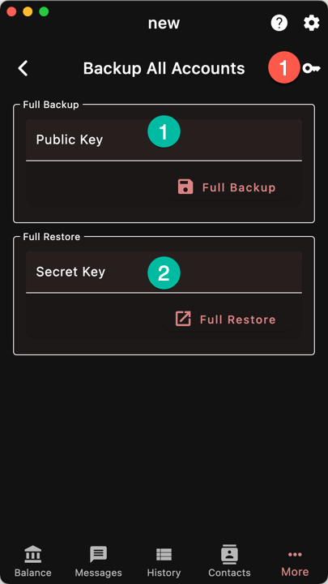
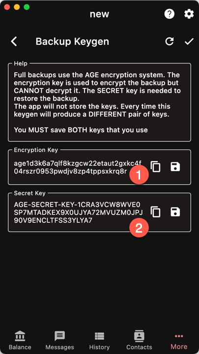

App Backup is a compressed & encrypted copy of 
the application database.

It contains all the account and the synchronization
data.

By restoring from an app backup, you will only
have to catchup from the point the backup was made.

This can be a huge time saver, especially if you have
several accounts.

## Generating a keypair

The backup is encrypted using the AGE software suite.
Before you can make a backup, you need to generate
a keypair. This can be done using the AGE tools
or in Ywallet.

Tap the button (1). The app will generate a *NEW*
key pair.

{}
You need to save **BOTH** the encryption key
and the secret key.
{}

Technically speaking, the encryption key can be derived from the 
secret key but not the other way round. However, it is simpler
to just save both of them.

Once you return to the previous page, the secret key
will **NOT** be available anymore. You MUST save it
before.

## Save/Restore

1. Enter the encryption key and select an output file
1. Enter the secret key and open a file

{}
You need to remove the database encryption before making
an app backup.

If the decryption is successful, you have to close
and restart the app for it to take effect.
{}

## Manual Restoration

The app backup can be recovered without Ywallet by 
following these steps:
- Decrypt the AGE file using 
[age](https://github.com/FiloSottile/age)
or [rage](https://github.com/str4d/rage)
- unzip the result
- open the database files with SQL Lite 3+
