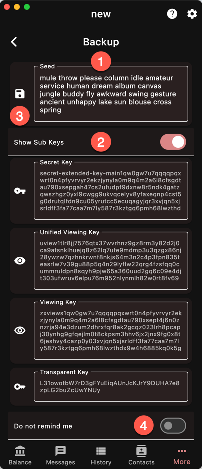

Saving the seed phrase is the #1 way to save
your account. It is compatible with most
wallet apps, i.e. you can recover your funds
using another wallet than Ywallet.

However, every account has its own seed phrase
and you *MUST* save every seed phrase if you
have multiple accounts.

Moreover, the seed phrase saves your account
keys but not the synchronizationd data.
After you recover, you will have to 
rescan the blockchain from the account height.

The account height is not part of the seed
and ideally should be also saved. In case of
doubt, you can always rescan from the first
shielded block but it could take much longer
than if you used the wallet birth height.

From the seed phrase, the wallet app derives
three sets of keys, corresponding to each
[pool]({}).

You can use the individual keys if your wallet
app does not support seed phrases. Otherwise,
just keep the seed phrase.

{}
Keys can be recalculated from the seed phrase
but the seed phrase cannot be derived from the keys.
{}

{}
Some of the keys are long and do not fit completely in the 
panel. Make sure you select the entire text or better
yet, use the export buttons.
{}

1. Seed phrase
1. Other keys
1. [Export buttons]({})
1. Toggle the backup reminder from the main page
