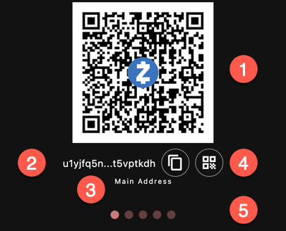

Unlike other cryptocurrencies, Zcash and Ycash 
accounts can have several addresses (with different
properties).

The Zcash protocol involves a few crypto systems and addresses:
- the "traditional" Bitcoin inspired addresses: transparent addresses,
- the shielded/private addresses. Zcash has developed and improved
shielded transactions based on zero-knowledge proofs. At this point,
there are three types of private systems:
    - Sprout,
    - Sapling,
    - Orchard.

{}
Zcash started with Sprout. Then Sapling
drastically improved the performance. Finally Orchard
eliminated the need for a trusted setup.

These systems are *not* compatible. But you can make
a transaction that moves funds between these systems
(i.e. pools) at no cost (besides the small transaction fee).
{}

Nowadays, Sprout is deprecated. Ywallet does not support it.

## Keys

Since Transparent, Sapling and Orchard are different crypto
systems (working with different equations, etc.), a key pair
for one system is not valid in another.

Shielded wallets manage distinct key pairs for each pool
based on a common seed phrase.

{}
If you have the seed phrase, you can recover all three
addresses. But if you only have one of the secret keys,
you cannot recover the other ones.
{}

## Addresses

Usually a key is associated with an address. You can
experiment with keys and addresses on a website
such as the
[Mnemonic Code Converter](https://iancoleman.io/bip39/).

That is true for the Transparent and Sapling pools.
However, the Orchard pool does not have a dedicated 
address format.
Instead, Orchard uses the Unified Address (UA) format.

A UA is a group (of maybe a single) "receivers". A receiver
is basically the same as a traditional address but in binary form.
For example, a UA can contain a Transparent and a Sapling receiver
or a Transparent and an Orchard receiver.

Without decoding the UA, there is no way to tell what's inside,
just like you cannot tell what's inside a ZIP file by looking
at its extension.

The advantage is that moving forward, every Zcash address
will be a UA. When new pools get added, they will be added
as a new receiver type, without changing the UA format.

{}
UA do not "magically" upgrade to a new pool. If
your UA does not include the receiver for a given
pool, it cannot get payments to that pool.
However, you can receive on a different pool and
then consolidate at a later time.
{}

## Display

1. Current Address QR code
1. Address (maybe truncated when too long). Use the button to copy
the full address to the clipboard
1. Type of the address shown
1. Buttons to copy to clipboard and create a 
[payment URI]({})
1. Carousel page indicator

By swiping through the address caroussel, Ywallet shows:
- the main address. That's the address type that it configured in the 
[settings]({}). 
By default, it is the UA with all the receivers.
- a diversified address of the same type. See below for more explanation.
- a legacy sapling address. For use with other apps that haven't
migrated to UA yet.
- a UA with only the Orchard receiver. For use when you want to receive funds as Orchard.
- a transparent address. For use with other apps that haven't
migrated to shielded & UA yet.

## Diversified Addresses

Shielded addresses are not unique for a given key pair. 
In fact, there are billions of valid addresses for the same
key. They are all equivalent and unlinkable. Given two 
addresses, there is no easy way to determine whether they 
come from the same key or not.

Diversified Addresses are designed to be used when you want to give
distinct addresses for the same account.

Funds coming into *any* of these diversified addresses
can be decrypted with the same key. Therefore, if
you use one address or a million diversified addresses,
the synchronization time is the same.

But if you were to use a million different addresses
(like the ones created by ZecWallet), the synchronization
would take a million times longer.

Ywallet generates diversified addresses based on time, just
like an authenticator code.

Every few seconds, you will get a new diversified address.

The old addresses are still usable.

{}
Since diversified addresses only work with shielded receivers,
the diversified addresses do not contain a transparent receiver
even when the main address does.
{}
