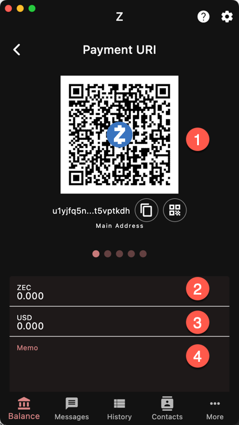

A payment URI is a pre-filled payment slip. The sender can scan
the QR code or input the payment URI in their wallet
(if their wallet supports them)
and the payment information is automatically filled.

To create a payment URI, enter:
1. the address. You can swipe through the different types
of address.
1. the amount in ZEC
1. or the amount in the reference currency. It will be
converted to ZEC automatically
1. A memo. Only shielded addresses support memos.

The payment URI updates automatically as you input
the information.

If you want to save it as an image, tap the 
[QR button]({})
below the QR code.
