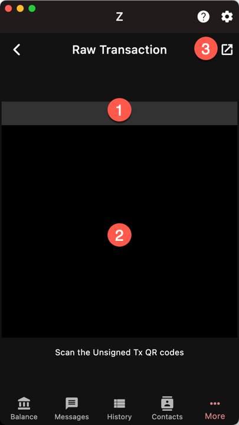
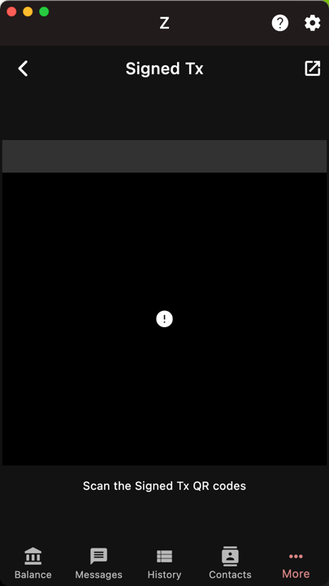

The Cold Wallet feature uses two devices running Ywallet.
- the first device has the viewing key and is connected to the
Internet. It can synchronize and report the account
balance
- the second device has the secret key but is disconnected
from the Internet. It can sign transactions prepared on
the first device.

By keeping the secret key on a device that remains
offline *permanently*, the account cannot be
hacked by remote access. It offers the
highest level of security.

Note that this is different from having a second
device that has your secret key as a backup.
Because as soon as you active it, the device
comes online and may get compromised.

{}
The key aspect of a cold wallet setup is that
the second device can sign transactions
*multiple times*
while *remaining offline*.
{}

## Step 1 - Make the unsigned transaction

The transaction is prepared normally. Once
it reaches the 
[transaction report page]({}),
use the cold button.

## Step 2 - Sign the transaction

The wallet (1) now shows an animated QR code.
The unsigned transaction is too large to fit in a single
QR code, therefore it is split into a sequence of images.

On the *offline* device, open the sign menu: `More/Sign`.
Make sure that you have selected the account that holds
the secret key.

If your devices are close to each other and 
the can scan the QR codes, scan them until the progress bar fills up.

Otherwise, save the transaction to a file and transfer
the file to the second device.

1. Progress bar
1. QR code camera
1. Open unsigned transaction file

## Step 3 - Broadcast the signed transaction

Then after the transaction is signed, repeat
the same process to bring the *signed transaction*
back to the first device. It will be shown as
animated QR codes on the offline device.

Select `More/Broadcast` on the *online* device
and scan or load the signed transaction.

Congratulations, you have made a cold wallet
transaction.
