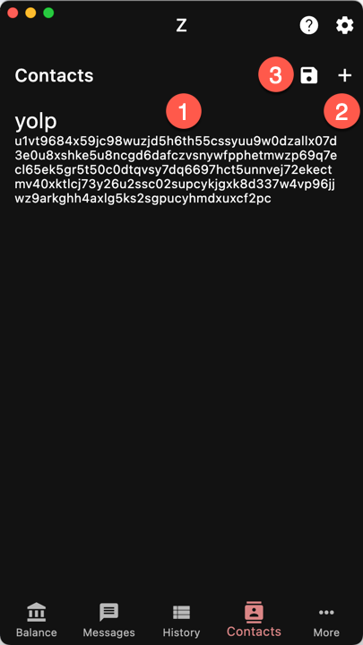

`Contacts`

Contacts is an address book that stores
names and addresses.

{}
Each account has its own address book but
the Contacts page combines all the contacts.
{}

When you create a new contact, it is
saved in the current account.

1. List of contacts
1. Button for adding a new contact
1. Button to save contacts to the blockchain

Saving your contacts to the blockchain
makes a special self-transaction that
contains your unsaved contacts. 
You only have to pay the miner's fee.

When a wallet is restored, the contacts
are reloaded along with the balance.

If you store a unified address, the wallet
will recognize a transaction made to
any of its receivers.
