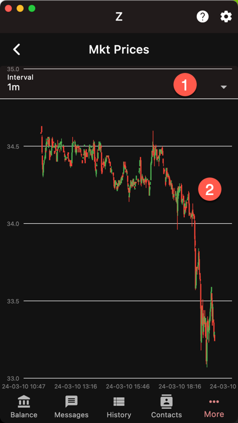

The chart takes values from the Binance exchange
in near real-time. The lowest granularity is
1 minute per candle and can go up to 1 month.

1. Candle width
1. Chart

A candle has the open, high, low, and close
price for a given interval and is either
green or red based on whether the close
price is greater or lower than the open price.

