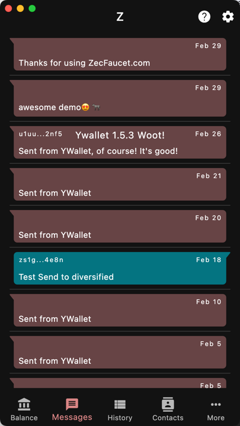
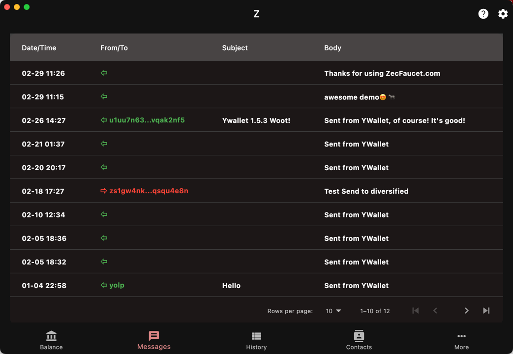

`Messages`

With transactions, you can have memos or messages.

Messages are your transaction memos shown in a
more friendly way. Like transactions, they can
be organized as a list or as a table.

## List

## Table

If you have a contact in your address book
with the matching address, Ywallet will display
the contact name instead of the address.

Also, the list shows your message as a chat.
However, some of the messages may not
have a known sender.

Clicking or tapping on a message will navigate
to the corresponding transaction.
