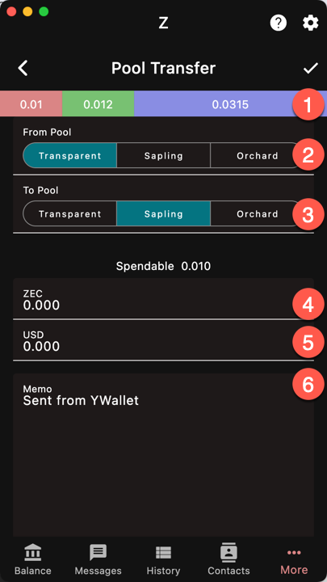

`More/Pools`

Currently there are three pools or types of ZEC:
- transparent
- sapling
- orchard

The last two are shielded.

Funds from any pool are fungible. In other words,
you can make a transaction that uses funds from
any pool, and pays to any pool. There is no
financial difference between them, like there is
no difference between the 1 USD note and the 1 USD coin.

However, it does not mean that they have the same
properties. Transparent ZEC are synchronized nearly
instantly whereas shielded ZEC require block scanning,
trial decryption, etc. but are private.

Therefore, you may want to move funds from one pool
to another by making a transaction from your account
to itself. The protocol does not distinguish between
self-transactions and other types of transactions. 
You will need to pay the fee as usual.

One way to move funds is to simply enter your wallet
address as the recipient but this does not give you
granual control on the operation.

The Pool Transfer Page offers several 
specific options for this use case.

1. The current funds in each of the pools
1. The source pool of the transfer
1. The destination pool of the transfer
1. The amount sent in crypto
1. The amount sent in the 
[reference currency]({})
1. A memo
1. The Max amount of an output note. For example, if you 
send 11 ZEC and set a max amount of 5, the transfer will
create 2 notes of 5 ZEC and 1 note of 1 ZEC.

Use the "Max amount" option to pre-split your notes 
so that you don't end up having to wait for the confirmation
of the change.
