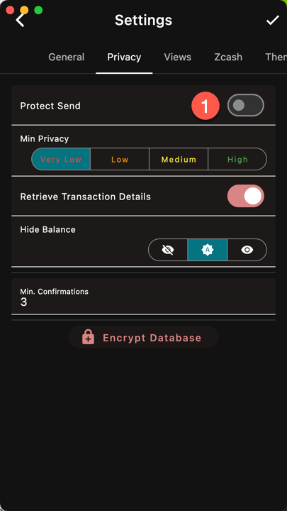

1. With Protect Send active, making a payment will 
require device unlock
On Mobile devices, you can also Protect Open. 
When turned on, launching the app required device unlock.

On Desktop, Protect Open is replaced by the 
[Database Encryption]({})
which will ask for the password at launch.
