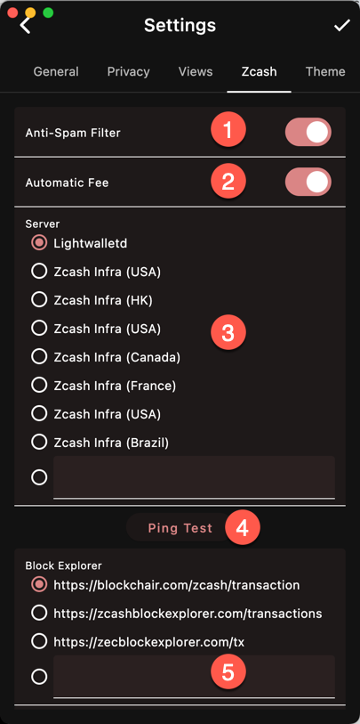
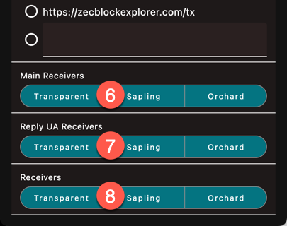

1. The Anti-Spam filter excludes the processing
of large transactions that occurred during
the spam period of 2023-2024. 
1. Calculate the fee automatically using ZIP-317
rules (highly recommended). You transaction
may get stuck if the fees are too low
1. Server
1. Ping each server and get the latency
1. URL of the block explorer
1. Receivers included in the main address
1. Receivers included in the reply-to address (used
when you decide to include your address in a 
message)
1. Receivers used when sending to a UA. See
below

## Spam Filter

{}
To take full
advantage of the spam filter, 
also connect to one of the
Zcash Infra servers
{}

## Server

If you run your own Lightwalletd server,
you can enter its URL.

## Explorer

Choose one of the preconfigured block explorer
or enter a custom URL.

## Receivers
For example
if you only select Orchard and send to a UA
that has Transparent, Sapling & Orchard receivers,
only the Orchard receiver will be used