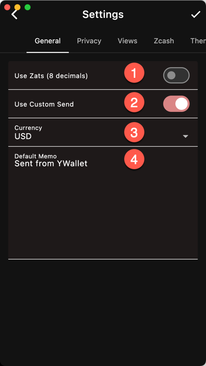

1. Display amounts in zats or millis. There are 100 000 000 zats per ZEC.
1. Use Custom Send by default
1. Reference Currency
1. Default Memo

## Currency
Use one of the supported FIAT currency or Crypto (BTC, ETH, etc.)

## Custom Send
Custom Send can be configured to show/hide the
fields you want.
See [View]({}).
