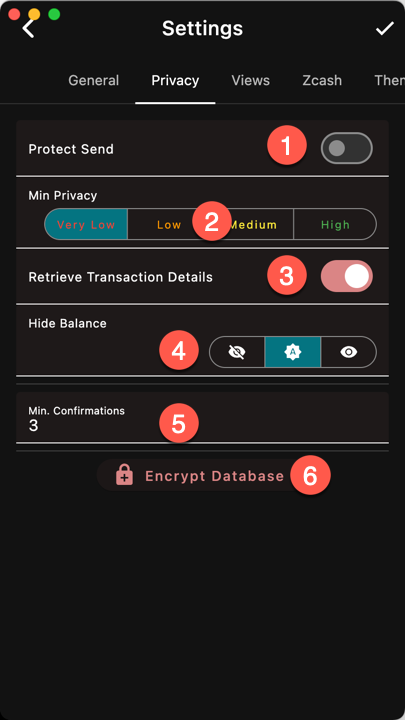

1. Protect Open and Send with the device lock
screen
1. Minimum Privacy Level. Transaction below
this level are blocked and need user confirmation
to override
1. Fetch transaction details for memo and outgoing
addresses
1. Hide/Show the account Balance on the Main
Account Page
1. Minimum Number of Confirmations before
a note can be spent
1. Encrypt the database with a password
(only available on Desktop. Mobile devices
always encrypt the db)

## Transaction Details
Getting the transaction details reveals your
transaction ids to the remote server.
The actual content of the transaction is
hidden.
