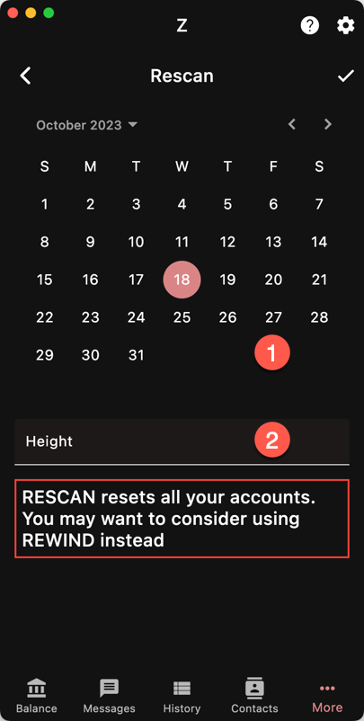

Use Rescan when you want to reset all your accounts
and scan the blockchain data from a given point in
time / height.

This is particularly useful if you have an issue
with your wallet and want to reset it, but also
when you import an old account and want to recover
its balance.

The synchronization data is deleted but your
accounts are kept. Then the wallet starts downloading
and scanning blocks from the given height.

If you have multiple accounts, make sure you enter
a height that is lower than the height of the first
transaction (of every account).

{}
Scanning updates all the accounts at once. If you want
to rescan multiple new accounts, it is much better to 
first, create them all and then rescan one time.
{}

There was a period of very large blocks from Jul 2023
to Oct 2024. If your wallet was created after this
period, make sure you enter the right height/date.
Otherwise it will spend a lot of time 
processing these blocks needlessly.

1. By date
1. By height

{}
Resetting an account does not make you lose your funds since
they are recorded on the blockchain.
{}

Resetting an account means deleting its synchronization data.
The balance is reset and the blocks have to be scanned to 
look for the available funds.
