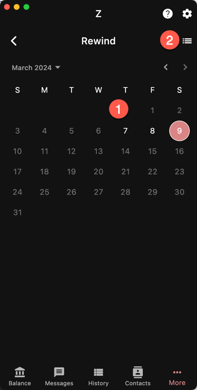
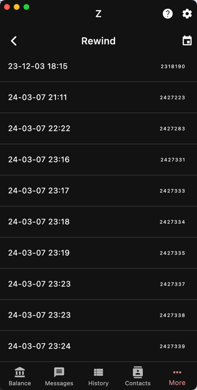

Use Rewind when you want to rollback the synchronization
data to a previous point and then let it catch up from there.

Rewinding deletes the synchronization data *after* the
given date/height.

This is useful if you notice an anomaly with your wallet
that happened after a certain height. If you think
your wallet was OK prior to that point, you can try
rewinding to it and see if your issue is resolved.

Normally, rewinding is not necessary unless you are restoring
an old wallet.

## Example

You have a wallet created in 2023 that is now fully synced.
You import a new seed phrase from a wallet from Jan 2024.

If you rescanned from Jan 2024, the first wallet data from 2023-2024
would be lost.
You could rescan from 2023 but that would redownload the data 2023
that you already have processed.

The best solution is to rewind to Jan 2024, the data from that
date is downloaded again but not any data from 2023.

{}
The wallet can only be rewound to a previous checkpoint.
{}

Warp Sync works in chunks of blocks. A checkpoint is 
made at the end of every chunk. 

## By Date

1. Date
1. Switch to checkpoints

## By Checkpoint

