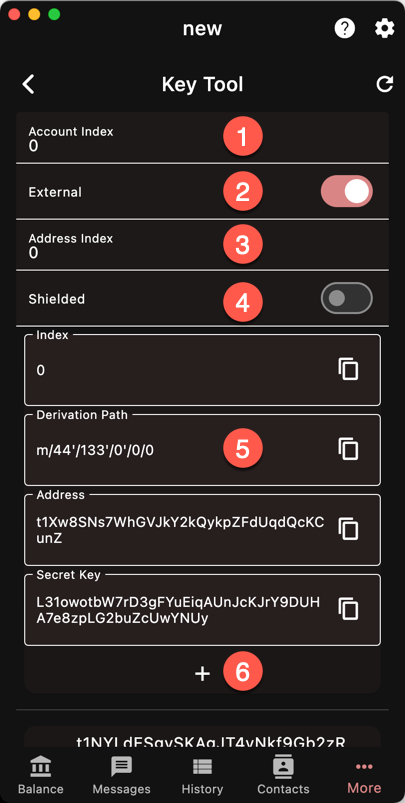

The Key Derivation Tool allows you to determine
the private keys and addresses at various
standard paths.

Transparent and Shielded addresses use different
derivation paths. Ywallet is programmed to follow
the standards BIP-44 and ZIP-32.

1. The account index. ZWL increments it
for every new shielded address
1. Use External for receive addresses and
Internal for change
1. Address Index. ZWL increments it for 
every new transparent address. It is not
used by shielded addresses
1. Toggle between deriving shielded or
transparent keys
1. A list of 100 keys starting from the
given account index. 
1. Add this address as a new account

{}
If you know which addresses have funds,
just create new accounts for them.
{}
