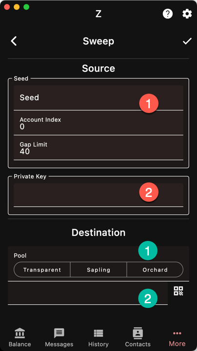

Sweep funds works with either 
1. a seed phrase and will scan a range of addresses
1. or a single transparent private key

Then select the destination of the funds,
Either
1. Your current account, into one the pools
1. Or to any address (this appear when no pools
are selected)

You can only sweep transparent addresses
and all the available funds are collected.
