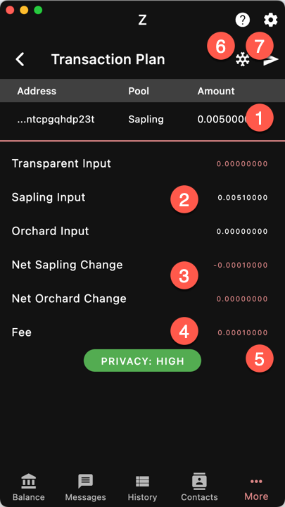

The Transaction Report gives you
a summary of the transaction **BEFORE**
it gets signed and broadcasted to the network.

{}
This is your final opportunity to check
that everything is alright before
the transaction becomes irreversible.
{}

1. Output section. This shows every address
you are sending funds to, by address and amount.
If you are sending to a unified address, you
can see what receiver was chosen.
1. Summary of the source of funds by pool.
1. Change of value of the pools after the transaction.
The protocol hides the actual amount in and out of 
the shielded pools *but* the net change is disclosed.
This information is commonly called the *turnstile*
1. The transaction fee. The fee is public information
1. The privacy level. See below
1. Press to create an unsigned/cold transaction
1. Press to sign and send the transaction

If your device does not have the secret key,
you can only create a cold transaction.

The data displayed in the theme primary color
are public.

## Privacy Level

Depending on the recipient addresses, the amounts
and the notes available in your wallet, the transaction
can have different levels of privacy.

For instance, if you send to a transparent address
and your wallet only has transparent funds,
the transaction will be t2t and fully public,
just like with Bitcoin. These transactions have
"VERY LOW" privacy.

A transaction has one of the following levels of
privacy:
- VERY LOW: transparent to transparent
- LOW: shielded to transparent
- MEDIUM: shielded to shielded but with some non
negligible going through the turnstiles
- HIGH: shielded to shielded with only fees
disclosed

{}
Ywallet will always make the transaction
with the highest level of privacy possible
considering the recipient addresses, the amounts
and the notes available.
{}

You can set a 
[minimum level of privacy]({}). 
If 
a transaction cannot be made that matches or
exceeds that level of privacy, you will have
a warning message and the transaction will
not be made unless you decide to override.
