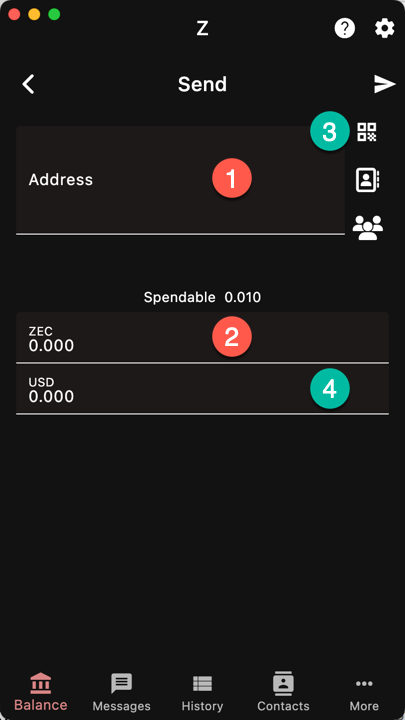
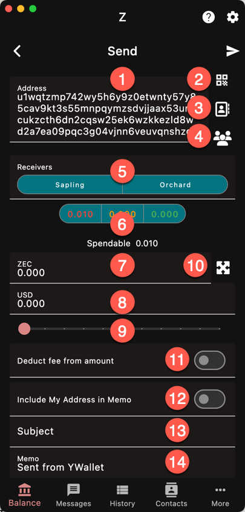

To make a simple payment, you will need to know:
1. the recipient address,
1. the amount.

Press the send button at the bottom right corner
of the account info page to open up the Send Form.

Addresses are practically never entered manually.
They are either copy/pasted, scanned, or taken 
from the contact list.

The buttons (3) on the right side of the address
will respectively:
- open the [QR scanner]({})
- ask you to pick up a [contact]({})
- ask you to select one of the accounts (for account
to account transfers)

{}
If the address is shielded, an encrypted memo can be added to the transaction.
{}

## Custom Send

Custom Send can be activated for every send by switching it on
in the [settings]({})

It gives you more control over the transaction.

There are many parameters that can be used in this mode.

1. [Address]({})
1. [QR Code Scanner]({})
1. [Address Book / Contacts]({})
1. [Accounts]({})
1. Pools from Receiver Address. This field appears
if you use a unified address that has more than
one receiver. It allows you to *disable* some of the 
recipient receivers. This field shows up if the
address has more than one receiver after filtering
by 
[Receivers]({}) in the settings.

1. Pools from Sender. Select the pools from *your*
wallet that you want to use. This allows you to
force a type of transaction that the wallet would 
not do. Ex: t2t even if you have shielded funds.
1. Amount in Crypto
1. Amount in Fiat / [Reference Currency]({})
1. Amount Slider
1. Max Amount
1. Net/Gross Amount Switch. When off, the input amount 
is the amount that the recipient gets, i.e. the 
sender (you) pays the fees. Otherwise, the fee
is deducted from the amount received and the recipient
gets slightly less than the amount specified.
1. Include Reply-To Switch (see next section)
1. Subject
1. Body

{}
These fields can be enabled/disabled in the
[settings]({}).
{}

## Memo

A memo can contain up to 512 bytes of arbitrary data.
YWallet defines a format that optionally has
the sender's address and a subject. 

This format is *only* recognized by Ywallet. If the
recipient uses another wallet, they will have the
raw memo.

{}
Unless you include your address in the memo,
the recipient will not be able to reply to you.
{}
